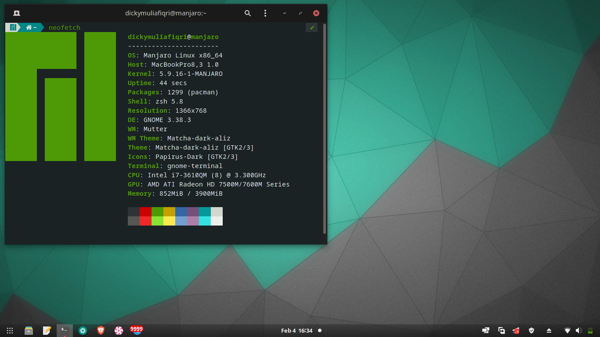

# EFI-Toshiba-L840M

DO WITH YOUR OWN RISK  
USING THIS EFI MEANS YOU ARE KNOW WHAT YOU DO AND WHAT SHOULD YOU DO  

### What's working :
- QE/CI AMD HD 7670M 2GB
- VGA Port
- Backlight Slider
- Fn+F(x) Keys
- Sleep 
- Bluetooth (Need to boot in windows to trigger bluetooth on mac)
- USB Remapping
- Audio (Conexant CX20590)
- Wi-Fi (AR9485 Wireless Network Adapter)
- Ethernet (AR8151 v2.0 Gigabit Ethernet)

### Screenshots

